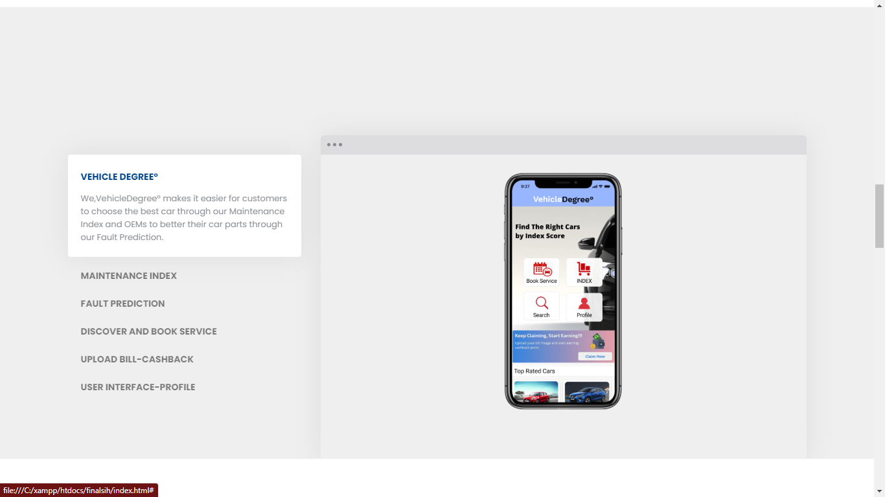

# Vehicle Maintenance Platform
- Automobile industry is a $2 Trillion industry. There are lot of choices available in the current market in terms of manufacturing, buying, selling and servicing of vehicles. Choosing the best and reliable vehicle is hectic.
- Our goal is to provide a Maintenance Platform which concise of an Authentic & Precise Maintenance Index score with an best in standard Fault prediction based on range, variant and location of the vehicle in order to make it simple for the consumers to choose the perfect car.VehicleDegree° also provides an platform for customers to look for Service Center and Book through the Web or App interface and Maintain Records of their billls and data securely. 
 VehicleDegree° considers customer satisfaction as the first priority and will work to constantly improve to provide world class services.
 
Smart India Hackathon 2020 - Winner

- Problem Statement : RA24
- Problem Statement OEM : CDK GLOBAL
- Team Name : Degree°

## Problem Statement

In Today’s world with so many cars, models in the market, it is hard to find out which car has a high maintenance cost/index that is authentic source. • Problem statement in Description o System that shows the health and Maintenance Index of various components of car models or car parts based on multiple factors o This will help new buyers to understand the maintenance costs of a certain model and probability of which car part requires more often servicing /change, OEM’s to understand which part is requiring frequent change and needs to be recalled and made better in the new models o Vehicle maintenance patterns across car models by mileage, usage , age of the vehicle , regional patterns across dealers, service stations and car manufacturer • Purpose and who will benefit o Consumers so they know which car has a higher maintenance and maintenance index. o Car Manufacturers , so they know which parts are getting serviced often based on the part change • How does it help the nation o Better understanding for consumers on which car to purchase with low Vehicle Maintenance Index o Govt has better understanding of car maintenance index before approving cars on the Road (ARAI Authority) • Practical and reasons why this idea could be a challenge from Implementation o Data Challenge : Build a dealer/service station network , OEM, consumers who can feed data into the system – without data this solution will not work o Ability to integrate this solution easily with the current systems which can collate the data o Marketing challenge : Owner within the Govt to take this ahead and invest this product o Political : OEM’s might not want such a system to be developed. • Domain Bucket o Transport , Vehicles.
https://www.sih.gov.in/

## Novel Algorithm

Uses a novel algorithm and method to collect and authenticate user data and runs on a self-developed Normalized
Relative Maintenance Index Algorithm to estimate maintenance index and fault of the vehicle.
- Presented research paper in ’International Conference on Next Generation of Internet of Things (ICNGIoT-2021)’ in
Data Science domain at GIET University, Odisha, India.
- Published in Lecture Notes in Networks and System (LNNS)– Springer Book Series Singapore
- https://doi.org/10.1007/978-981-16-0666-3 46(SCOPUS)

## Platform Features

## App 

## Team Members

